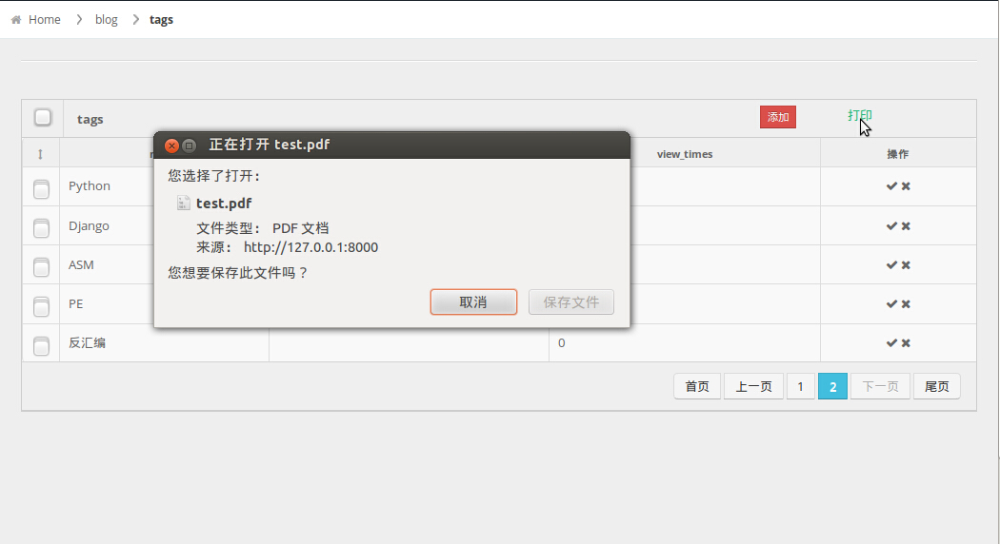
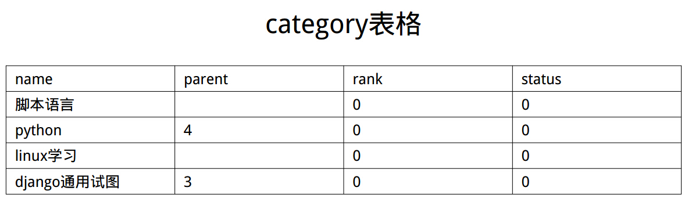
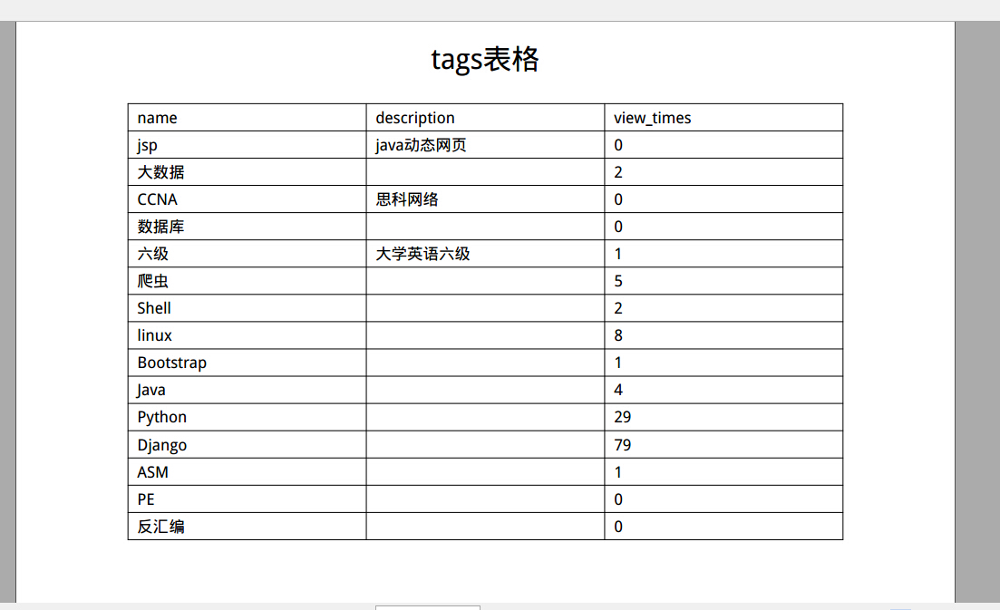

# pdf_report_printing
pdf报表(表格)生成report generation 
新手之作，大神勿喷 
pdf表格生成采用reportlab库，ubuntu12以后默认安装有（import reportlab 查看是否安装） 
通过重写ListView类视图的post方法实现对post请求的相应 
前台post请求，后台实时查询数据库生成pdf表格返回给前台保存 

qq:983003089

预览
=====

